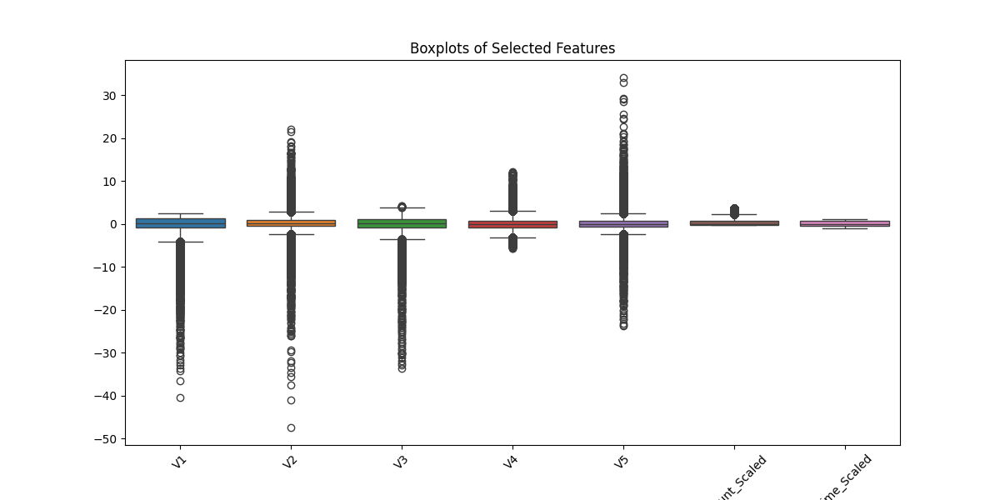
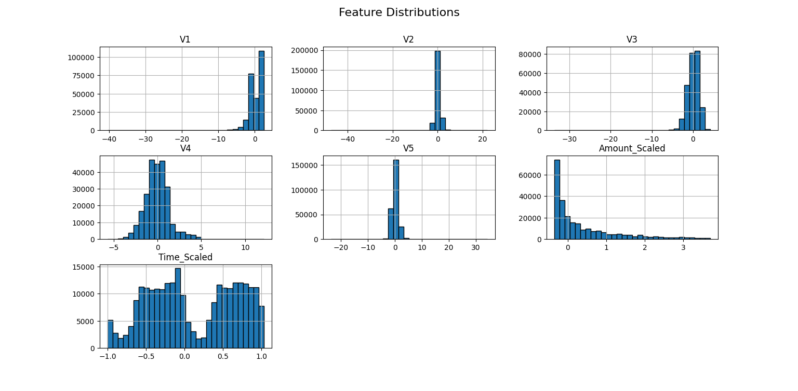
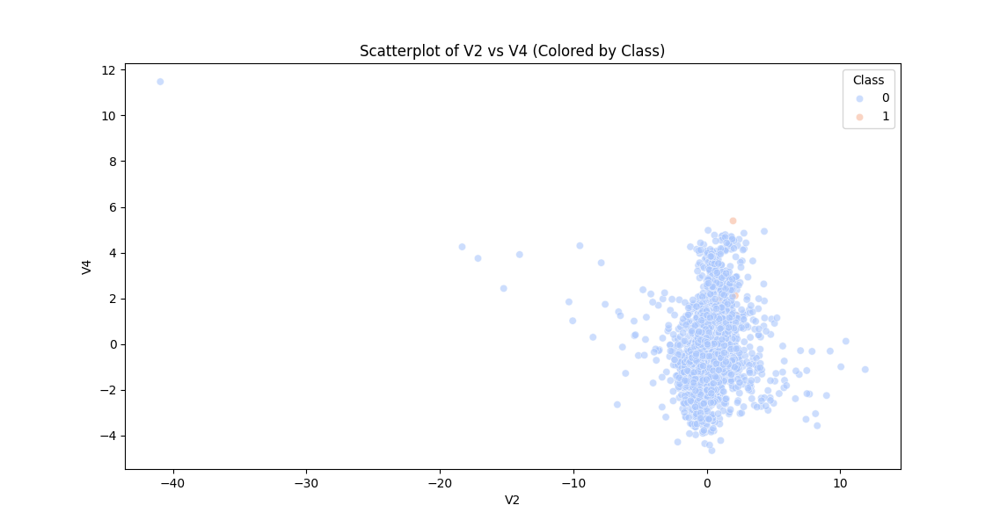

# 💳 Online Payments Fraud Detection with Machine Learning

**Author:** Leon Motaung  
**Environment:** Python, Pandas, NumPy, Scikit-learn, Matplotlib, Seaborn, Plotly  

---

## 🧠 Project Overview

This project detects **fraudulent online payment transactions** using **machine learning**.  
The dataset contains **284,808 transactions** with 30 features (`V1–V28`), plus `Amount`, `Time`, and `Class` (fraud = 1, normal = 0).

After **cleaning, preprocessing, and feature engineering**, the processed dataset is saved as `creditcard_final.csv`.

---

## ⚙️ Data Preprocessing

Steps performed:

- ✅ Handled missing values  
- ✅ Corrected data types  
- ✅ Encoded categorical variables (none present in this dataset)  
- ✅ Scaled features (`Amount` and `Time`)  
- ✅ Removed outliers using IQR  
- ✅ Added feature: log-transformed `scaled_amount`  
- ✅ Saved cleaned dataset as `creditcard_final.csv`  

---

## 📊 Data Visualization

The visual exploration shows **class imbalance, feature distributions, and correlations**.

### 1️⃣ Boxplots
Boxplots help detect outliers and feature spread.

---

### 2️⃣ Histograms & Feature Distributions
Feature distributions after scaling.

---

### 3️⃣ Correlation Heatmap
Shows relationships between features and the `Class` label.

---

### 4️⃣ Scatterplot
Scatterplot demonstrates patterns between two features (`V2` vs `V4`).

---

### 5️⃣ Class Distribution
The dataset is **highly imbalanced** — frauds are much fewer than normal transactions.

*Bar chart can be added similarly as `bar_chart.png` if available.*

---

## 🧩 Next Steps

1. Handle **class imbalance** (SMOTE or undersampling).  
2. Train models: Logistic Regression, Random Forest, XGBoost, LightGBM.  
3. Evaluate with metrics suited for imbalanced datasets: Precision, Recall, F1-score, ROC-AUC.  
4. Deploy model via Flask or Streamlit dashboard.

---

## 📁 Project Structure

